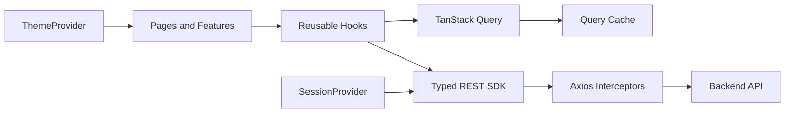

# Admin Dashboard

Panel administrativo en React + TypeScript para gestionar usuarios, roles, permisos y preferencias visuales desde una interfaz SPA. El proyecto está construido alrededor de un SDK REST tipado, hooks reutilizables de React Query y un pipeline de calidad que bloquea el build y los commits cuando el código no cumple las reglas.

## En una mirada

| Área | Decisión |
| --- | --- |
| Runtime | React 18 + React DOM |
| Bundler | Vite 7 + SWC |
| Lenguaje | TypeScript 5 con `strict` habilitado |
| Routing | Generouted + React Router |
| Server state | TanStack React Query |
| Estado local | Recoil y Context API |
| HTTP | Axios detrás de un SDK propio |
| Validación | Zod + React Hook Form |
| UI | Componentes propios, Tailwind CSS y Lucide |
| Feedback | React Toastify |
| Calidad | ESLint, Prettier, Husky y lint-staged |
| Package manager | pnpm |

## Capacidades

- Inicio de sesión, registro, consulta de perfil y cierre de sesión.
- Persistencia de token y refresh token en `localStorage`.
- Renovación automática del access token ante respuestas `401`.
- Protección de rutas para usuarios autenticados y visitantes.
- Gestión CRUD de usuarios, roles y permisos.
- Búsqueda, paginación y consultas remotas mediante hooks genéricos.
- Control de acceso por rol y pantalla de acceso no autorizado.
- Tema claro/oscuro con detección de preferencia del sistema.
- Personalización de colores para ambos temas y persistencia local.
- Componentes reutilizables para tablas, formularios, modales, selects remotos, badges, toolbar y navegación.
- Validación de formularios de login y registro con mensajes en español.
- Manejo centralizado de errores HTTP, sesión expirada y permisos insuficientes.

## Arranque local

### Requisitos

- Node.js compatible con Vite 7.
- pnpm habilitado.
- Un backend accesible desde el navegador con el contrato de autenticación y CRUD esperado.

### Instalación

```bash
pnpm install
```

### Variables de entorno

Crea un archivo `.env.local` en la raíz:

```dotenv
VITE_API_SERVICE=https://api.example.com
VITE_SECRET_KEY=valor-de-configuracion-local
```

`VITE_API_SERVICE` es el origen del backend. `VITE_SECRET_KEY` se usa para cifrar datos persistidos por `useRecoilStorage`.

> Importante: cualquier variable `VITE_*` forma parte del bundle del navegador. `VITE_SECRET_KEY` no debe tratarse como un secreto criptográfico ni como una frontera de seguridad. La autorización real debe vivir en el backend; el cifrado local solo protege el estado frente a una lectura casual del storage.

### Scripts

| Comando | Uso |
| --- | --- |
| `pnpm dev` | Inicia Vite en modo desarrollo. |
| `pnpm build` | Ejecuta tipos, ESLint, Prettier y genera `dist`. |
| `pnpm preview` | Sirve localmente el build generado. |
| `pnpm lint` | Ejecuta type-check, ESLint sin warnings y Prettier check. |
| `pnpm lint:fix` | Corrige ESLint y formatea TypeScript. |
| `pnpm check-types` | Ejecuta `tsc --noemit`. |
| `pnpm eslint` | Ejecuta ESLint con cache y `--max-warnings=0`. |
| `pnpm prettier:check` | Comprueba el formato sin modificar archivos. |
| `pnpm prettier:fix` | Aplica el formato Prettier. |

## Flujo de trabajo y commits

El flujo recomendado es deliberadamente explícito:

```bash
pnpm lint:fix
git add .
git commit -m "feat: update users table"
```

El hook `.husky/pre-commit` vuelve a ejecutar, en orden:

```bash
pnpm lint:fix && pnpm lint-staged && pnpm lint
```

Si ESLint, Prettier, TypeScript o cualquier validación falla, Git cancela el commit y deja visibles los errores.

El hook `.husky/commit-msg` exige el formato `tipo: descripción`. Tipos permitidos:

```text
feat, fix, update, docs, style, refactor, test, chore, build, ci, perf, revert
```

Ejemplos:

```text
feat: add role filters
fix: handle expired refresh token
refactor: simplify user service
```

## Arquitectura

La aplicación separa transporte, estado remoto, sesión y presentación:



### Composición de la aplicación

El punto de entrada es `src/main.tsx`. La composición principal queda así:

```text
RecoilRoot
└── QueryClientProvider
    └── ToastContainer
        └── ThemeProvider
            └── SessionProvider
                └── AppShell
                    └── Generated Routes
```

- `RecoilRoot` habilita el estado global.
- `QueryClientProvider` centraliza cache y consultas HTTP.
- `ThemeProvider` aplica tema y variables CSS.
- `SessionProvider` mantiene sesión, perfil y mutaciones de auth.
- `AppShell` renderiza el outlet y el selector global de tema.

### Estructura del código

```text
src/
├── api/                         # Servicios concretos de dominio
│   ├── index.ts                 # userService, roleService, permissionService
│   └── custom/UserService.ts    # login, signup, profile y logout
├── components/
│   ├── guards/                  # RequireAuth, RequireGuest, ProtectedRoute
│   └── ui/                      # Button, Table, Modal, forms, toolbar, etc.
├── config/
│   ├── dashboardMenu.ts         # Navegación del panel
│   └── queryClient.ts           # QueryClient y query keys
├── constants/                   # Estado persistente y constantes globales
├── context/                     # SessionContext y ThemeContext
├── enum/                        # Roles y rutas centralizadas
├── features/
│   ├── AppShell.tsx
│   ├── permissions/             # Listado y formulario de permisos
│   ├── roles/                   # Listado y formulario de roles
│   ├── settings/                # Configuración visual
│   └── users/                   # Listado y formulario de usuarios
├── hooks/
│   ├── core/                    # Hooks de queries, CRUD y storage
│   ├── useSession.ts
│   └── useTheme.ts
├── lib/                         # Utilidades de color y funciones comunes
├── models/
│   ├── app/                     # Menú, tema, sesión y media
│   └── entities/                # User, Role, Permissions
├── pages/                       # Rutas detectadas por Generouted
├── schemas/                     # Esquemas Zod de formularios
├── sdk/                         # Cliente REST genérico y contratos de respuesta
├── styles/                      # CSS global y variables de tema
├── types/                       # Declaraciones para Vite y Axios
└── utils/                       # Normalización de errores y helpers
```

## Routing y acceso

Las rutas se generan desde `src/pages`. Las rutas públicas y principales son:

| Ruta | Propósito |
| --- | --- |
| `/` | Entrada de la aplicación. |
| `/login` | Inicio de sesión para visitantes. |
| `/signup` | Registro de usuario. |
| `/dashboard` | Redirect al listado de usuarios. |
| `/dashboard/users` | Administración de usuarios. |
| `/dashboard/roles` | Administración de roles. |
| `/dashboard/permissions` | Administración de permisos. |
| `/dashboard/settings` | Tema y personalización visual. |
| `/unauthorized` | Respuesta para acceso no autorizado. |

Los guards se dividen por responsabilidad:

- `RequireAuth`: redirige a `/login` si no existe token.
- `RequireGuest`: impide que una sesión activa vuelva a login o registro.
- `ProtectedRoute`: valida si el rol actual aparece en la lista permitida.

`src/router.ts` es generado por Generouted. No debe editarse manualmente: cualquier cambio será sobrescrito por el generador.

## SDK REST

`src/sdk/core/Service.ts` expone una abstracción genérica para entidades que extienden `BaseEntity`:

```ts
findAll(params)              // GET collection
findById(params)             // GET collection/:id
findBy(params)               // GET custom path
create(params)               // POST collection
update(params)               // PUT collection/:id
delete(params)               // DELETE collection/:id
restore(params)              // PATCH collection/:id/restore
```

Los servicios concretos actuales son:

```ts
export const userService = new UserService()
export const roleService = new Service<Role>({ endpoint: 'roles' })
export const permissionService = new Service<Permissions>({
  endpoint: 'permissions',
})
```

`UserService` extiende el servicio base para añadir:

- `POST /auth/login`
- `POST /auth/signup`
- `GET /auth/profile`
- `POST /auth/logout`

### Interceptores Axios

`AxiosConfig` crea una instancia con timeout de 60 segundos y aplica:

- `Authorization: Bearer <token>` cuando existe access token.
- Eliminación de `Content-Type` para payloads `FormData` y boundary automático del navegador.
- Renovación concurrente controlada del token mediante una única `refreshPromise`.
- Tratamiento centralizado de `401` y `403`.
- Limpieza de tokens, cache de sesión y redirección a login cuando la sesión expira.

## Estado y fetching

### React Query

`src/config/queryClient.ts` define los defaults globales:

```ts
refetchOnWindowFocus: false
retry: false
staleTime: 5 minutos
gcTime: 30 minutos
```

Las claves compartidas son `session`, `users`, `roles` y `permissions`.

Los hooks genéricos evitan duplicar lógica:

- `useFindAll`: listado paginado con cache y parámetros serializados.
- `useInfiniteFindAll`: consultas paginadas con scroll infinito.
- `useCrud`: create, update, delete, restore y consultas puntuales por id/path.
- `useQueryParams`: sincroniza filtros permitidos con la URL.

Las mutaciones invalidan automáticamente la query key asociada después de una operación exitosa.

### Recoil y persistencia

`useRecoilStorage` combina Recoil, Zod y CryptoJS para persistir estado validado en `localStorage`. Actualmente se utiliza para el estado de búsqueda del dashboard.

El tema se persiste por separado mediante `ThemeProvider`:

- `theme`: modo `light` o `dark`.
- `theme-colors`: paletas personalizadas para ambos modos.

## Formularios y dominio

Los formularios usan React Hook Form y Zod:

- `schemas/auth.ts`: login y registro.
- `schemas/user.ts`: validación de usuarios.
- `schemas/role.ts`: validación de roles.
- `schemas/permission.ts`: validación de permisos.

Las entidades principales son:

```ts
User        // username, name, surname, email, blocked, role
Role        // active, permissions
Permissions // name, title
```

Todas se integran con el contrato base del SDK mediante `BaseEntity`.

## UI y tema

La UI vive principalmente en `src/components/ui` y `src/styles`.

- Tailwind CSS se usa para composición y estados locales.
- `src/styles/index.css` define variables y estilos globales.
- `ThemeProvider` aplica las variables al elemento raíz mediante `data-theme`.
- `ColorField` y `SettingsPage` permiten cambiar colores y restaurar paletas.
- Lucide proporciona iconos consistentes en navegación y acciones.
- `react-toastify` muestra feedback transversal de sesión y errores HTTP.

## Crear un nuevo módulo CRUD

1. Define la entidad en `src/models/entities` extendiendo `BaseEntity`.
2. Añade el servicio en `src/api/index.ts` o extiende `Service` para endpoints especiales.
3. Registra una query key en `src/config/queryClient.ts`.
4. Crea los esquemas Zod necesarios en `src/schemas`.
5. Implementa el listado y formulario bajo `src/features/<modulo>`.
6. Añade la página correspondiente bajo `src/pages/dashboard/<modulo>`.
7. Registra la ruta en `src/enum/routes..app.ts` y el menú en `src/config/dashboardMenu.ts`.
8. Reutiliza `useFindAll` para lectura y `useCrud` para mutaciones.
9. Ejecuta `pnpm lint:fix`, `pnpm lint` y `pnpm build` antes de preparar el commit.

No dupliques clientes Axios ni lógica de invalidación: la responsabilidad de transporte pertenece al SDK y la de cache a React Query.

## Contrato esperado del backend

El frontend asume:

- Respuestas de listado compatibles con `PaginationResponse<T>`.
- Respuestas de sesión con token, refresh token y usuario autenticado.
- Recursos `users`, `roles` y `permissions` con operaciones CRUD.
- Códigos HTTP `401` para sesión inválida y `403` para permisos insuficientes.
- Endpoint de refresh compatible con `/api/auth/refresh`.

Si el backend usa nombres o envoltorios diferentes, adapta los tipos del SDK o el servicio concreto, no los componentes de UI.

## Decisiones y límites conocidos

- El build exige type-check, ESLint sin warnings y formato Prettier antes de ejecutar Vite.
- El estado de sesión se guarda en `localStorage`; para un contexto de mayor sensibilidad conviene migrar a cookies `HttpOnly`, `Secure` y `SameSite` gestionadas por el backend.
- Las variables `VITE_*` son públicas en producción.
- `src/router.ts` es generado y queda excluido de ESLint para no romperse cuando Generouted regenere la cabecera.
- Los reintentos de React Query están desactivados globalmente; cada flujo debe decidir explícitamente si necesita reintentar.
- No existe una capa de tests automatizados configurada en los scripts actuales; `pnpm lint` y `pnpm build` cubren calidad estática, no comportamiento end-to-end.

## Checklist antes de abrir un PR

```bash
pnpm lint:fix
pnpm lint
pnpm build
git diff --check
git add .
git commit -m "feat: describe the change"
```

Un commit solo puede crearse si los hooks de Husky y la validación del mensaje se completan correctamente.
